[React & Redux](#What-is-React-and-Redux)

[How React Works ?](#how-react-works-?)

[Create React App](#Create-React-App)

[React SetUp with CDN](#React-SetUp-with-CDN)

[React Components](#React-Components)

[Component State](#Component-State)

[React Dev Tools](#React-Dev-Tools)

[DOM Events](#DOM-Events)

[Changing State](#Changing-State)

[Intro to Forms](#Intro-to-Forms)

[Single Page Apps & File Structure](#Single-Page-Apps-and-File-Structure)

[Nesting Components](#Nesting-Components)

[Outputting Array of Objects](#Outputting-Array-of-Objects)

[Stateless Components - Two Types of Component](#Stateless-Components)

[Conditional Output](#Conditional-Output)

[Forms Part-2](#Forms)

[Function-as-Prop](#Functions-as-Props)

[Deleting Data](#Deleting-Data)

[Recap and Virtual Dom](#Recap-and-Virtual-Dom)

# What is React and Redux ?

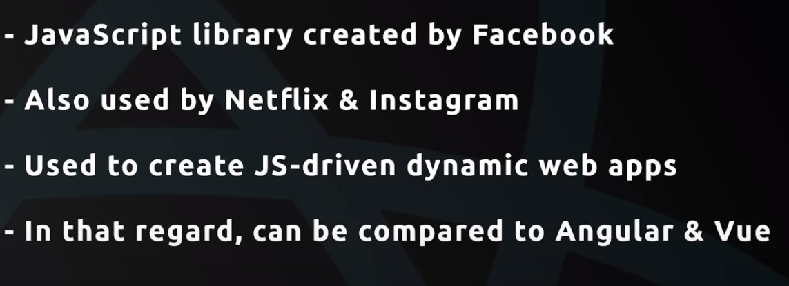

## Redux ?


# how react works ?

- v create components for diff. parts of our application.
  for example, component for navbar, search box, footer...
- job of react is to take these components and inject them in to the DOM. thus v can see them on the webpage.

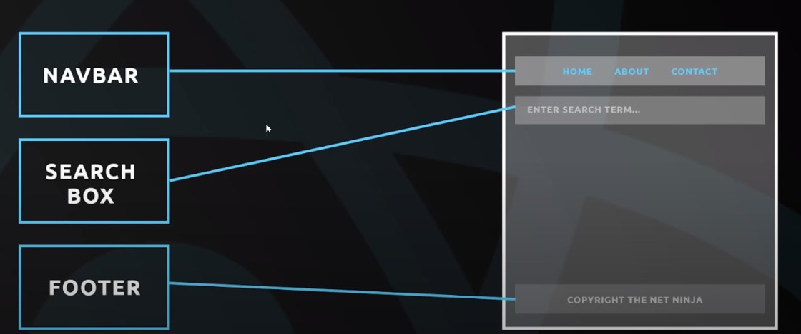

## how does REACT do this ?

- REACT takes all these components and create a js representation of the DOM. also called _Virtual DOM_.
- REACT take this _Virtual DOM_ and renders it to the browser. and browser then creates an actual DOM based on this _Virtual DOM_. thats how v see the components.
- every time v make a change in any of theses component, for eg; change ui state of the components, data inside this components. REACT look at that change and updates the DOM in the browser. this happens fast bcose of _Virtual DOM_.


- for every change a new Virtual DOM is created. and that new Virtual DOM is compared with old one. and it knows exaclty where to update those new changes in the DOM. so it only updates that part.

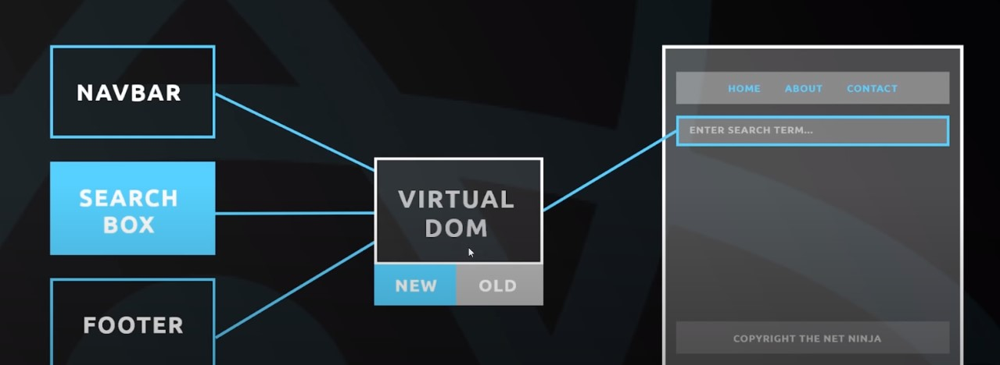

## Components and Templates

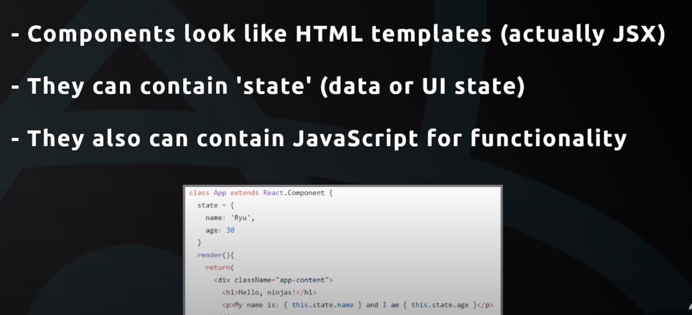

---

# React SetUp with CDN

[React CDN Link](https://reactjs.org/docs/cdn-links.html)

or

add below line of code to the index.html file

```js
<script crossorigin src="https://unpkg.com/react@17/umd/react.development.js"></script>
<script crossorigin src="https://unpkg.com/react-dom@17/umd/react-dom.development.js"></script>
```

_both lines of code is only responsible for development._

**install extensions in vs code**

1. ES7 React/Redux/GraphQL/React-Native snippets
2. Babel JavaScript

---

# React Components

## how to build a react component (Class Based Component)

- Create a class that extends from React.Component library. this class represents the component.
- Class Based component must have a render function that used to render our template to an html element.
- Inside a render function, return JSX template (JSX allows us to write html code inside JavaScript).

  1. JSX allows only one root element.
  2. Use className attribute instead of class.

- next v have to render this _App component_ to _div element_.
- use **ReactDom.render()** function for this.
- Inside the function, v pass 2 argument, one is component and other is element to which the component to be rendered.

**index.html**

```html
<body>
  <div id="app"></div>

  <script>
    class App extends React.Component {
      render() {
        return (
          <div className='app-content'>
            <h1>Hey Ninjas</h1>
          </div>
        );
      }
    }
    ReactDOM.render(<App />, document.getElementById('app'));
  </script>
</body>
```

- But it doesnt works since JSX is not supported in the browser. throws error im console.

```console
Uncaught SyntaxError: Unexpected token '<'
```

- So we have to transpile this code to something that browser supports.
- v so this using Babel. https://babeljs.io/setup#installation

- add this two scripts

```js
<script src="https://unpkg.com/@babel/standalone/babel.min.js"></script>

<script type="text/babel">
    // component
</script>
```

- now when v inspect element, can see _App component_ nested inside the div element.

---

### Outputting Dynamic contents inside Component

```html
<script type="text/babel">
  class App extends React.Component {
    render() {
      return (
        <div className='app-content'>
          <h1>Hey Ninjas</h1>
          <p>{Math.random()}</p>
        </div>
      );
    }
  }
  ReactDOM.render(<App />, document.getElementById('app'));
</script>
```

- a random number is shown every time page reloads.

---

# Component State

## Theory

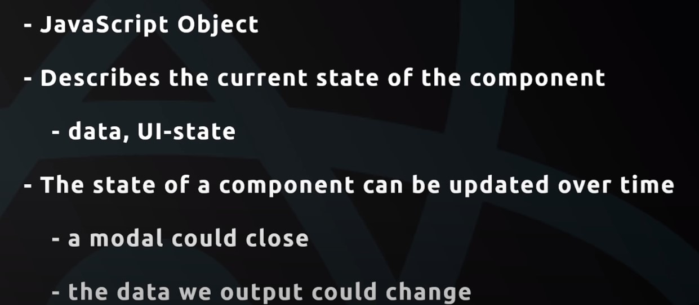

**Example: Shopping Cart Component**

```js
{
  item: [
    { name: 'item-one', price: 44 },
    { name: 'item-two', price: 64 },
  ];
}
```

- Above javascript object is a _state_ of _Shopping Cart Component_.

- Updates the state when v add a new item to shopping cart.

```js
{
  item: [
    { name: 'item-one', price: 44 },
    { name: 'item-two', price: 64 },
    { name: 'item-three', price: 68 },
  ];
}
```

- Using _state_ to o/p contents inside the component dynamically.

- Changes made in state r reflected on template. Thus it is dynamic.

---

## Adding State to our App Component

**index.html**

```html
<script type="text/babel">
  class App extends React.Component {
    state = {
      name: 'Bale',
      age: 45,
    };
    render() {
      return (
        <div className='app-content'>
          <h1>Hey Ninjas</h1>
          <p>
            Name is: {this.state.name} with age: {this.state.age}
          </p>
        </div>
      );
    }
  }
  ReactDOM.render(<App />, document.getElementById('app'));
</script>
```

- v add a _state_ object with in our component.

- later render them in template. As state changes rendered content in template changes.

---

# React Dev Tools

- Install react dev tools extension on chrome.

  [React Dev Tools Link](https://chrome.google.com/webstore/detail/react-developer-tools/fmkadmapgofadopljbjfkapdkoienihi?hl=en)

- On Updating the state in Components tab in React Dev tools, cooresponding changes dynamically reflected in the template as well.

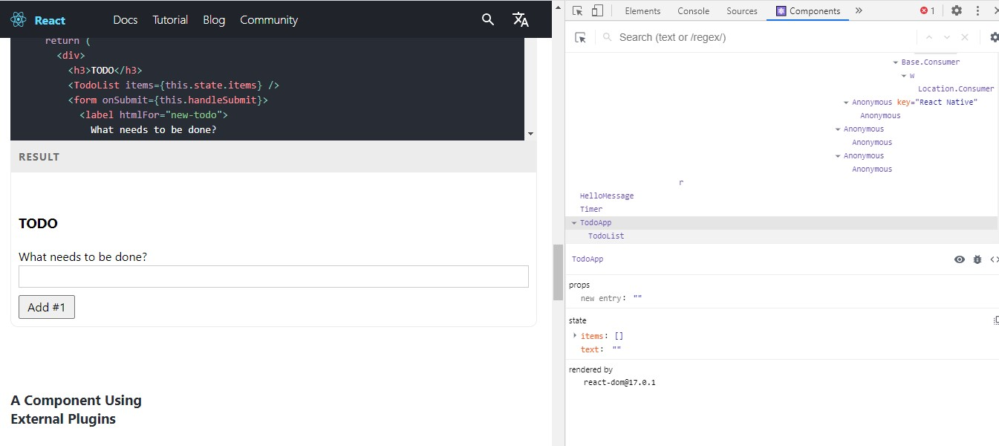

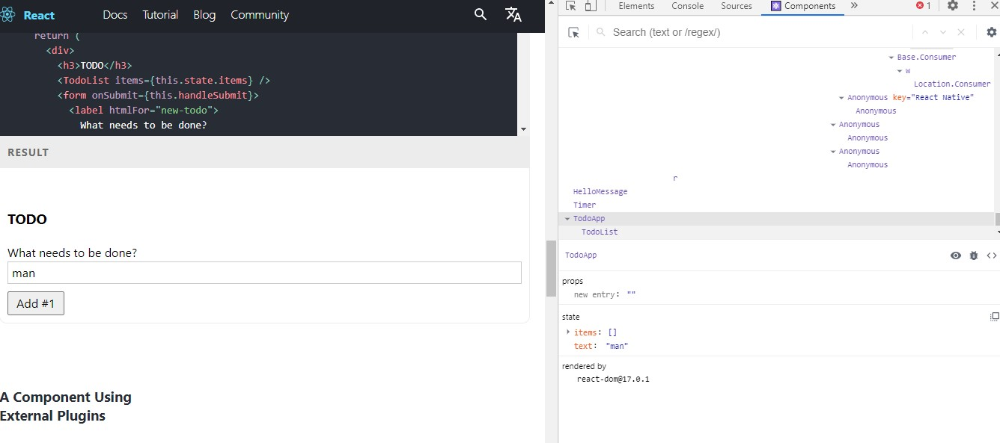

---

# DOM Events

## Click Event

- define a function in the component. pass an event object e.

- later, V set a reference of the function in the button element. On clicking button, it finds that reference and fires it.

- Note: V are not invoking the function in the button, since that will invoke the function straight when the page loads.

```html
<script type="text/babel">
  class App extends React.Component {
    state = {
      name: 'Bale',
      age: 45,
    };
    handleClick(e) {
      console.log(e.target);
    }
    render() {
      return (
        <div className='app-content'>
          <h1>Hey Ninjas</h1>
          <p>
            Name is: {this.state.name} with age: {this.state.age}
          </p>
          <button onClick={this.handleClick}>Click Me</button>
        </div>
      );
    }
  }
  ReactDOM.render(<App />, document.getElementById('app'));
</script>
```

- _handleClick_ is the function to be fired on clicking the button. v set reference to this function using _this_ keyword.

## MouseOver Event

```html
<script type="text/babel">
  class App extends React.Component {
    state = {
      name: 'Bale',
      age: 45,
    };
    handleClick(e) {
      console.log(e.target);
    }
    handleMouseOver(e) {
      console.log(e.target);
    }
    render() {
      return (
        <div className='app-content'>
          <h1>Hey Ninjas</h1>
          <p>
            Name is: {this.state.name} with age: {this.state.age}
          </p>
          <button onClick={this.handleClick}>Click Me</button>
          <button onMouseOver={this.handleMouseOver}>Hover Me</button>
        </div>
      );
    }
  }
  ReactDOM.render(<App />, document.getElementById('app'));
</script>
```

# Changing State

- we cant access the state using this keyword with in a function in the component.
- I meant like this,

```js
class App extends React.Component {
  state = {
    name: 'Bale',
    age: 45,
  };
  handleClick(e) {
    console.log(e.target);
    console.log(this.state.name);
  }
  render() {
    return (
      <div className='app-content'>
        <p>
          Name is: {this.state.name} with age: {this.state.age}
        </p>
      </div>
    );
  }
}
```

- but we can access the _state_ using _this_ keyword inside the _render()_ method.

- To get access to the _state_ using this keyword, v use _arrow functions_ instead of _custom functions_ in
  the component.

```js
class App extends React.Component{
    state = {
        name: 'Bale',
        age: 45
    }
    handleClick = (e) => {
        console.log(e.target);
        console.log(this.state.name, this.state.age);
    }
```

- when v use arrow function, it binds the value of _this_ keyword to the component instance.

## Changing the state property

```js
 class App extends React.Component{
            state = {
                name: 'Bale',
                age: 45
            }
            handleClick = (e) => {
                this.setState(
                    {
                    name: "shaun",
                    age: 67
                });
                console.log({name: this.state.name, age: this.state.age});
            }
```

- here v change the state property value on click event. use **setState()** method.

---

# Intro to Forms

## Tracking Changes in Element using onChange Event

```js
class App extends React.Component {
  state = { name: 'Bale', age: 45 };
  handleChange = (e) => {
    this.setState({ name: e.target.value });
  };
  render() {
    return (
      <div className='app-content'>
        <p>Name is: {this.state.name}</p>
        <form>
          <input
            type='text'
            name='name'
            id='name'
            onChange={this.handleChange}
          />
          <button>Submit</button>
        </form>
      </div>
    );
  }
}
```

- _onChange_ event fires whenever v make a change in input element.
- Using this event, we can keep track of changes made in input field.

## Submitting the Form using onSubmit Event

- Use _onSubmit_ event inside form element.

- set reference to the function.

- define function and prevent page reload of browser on submit.

```js
class App extends React.Component {
  state = {
    name: 'Bale',
    age: 45,
  };
  handleChange = (e) => {
    this.setState({
      name: e.target.value,
    });
  };
  formSubmit = (e) => {
    e.preventDefault();
    console.log(`${this.state.name} submitted the form`);
  };
  render() {
    return (
      <div className='app-content'>
        <p>Name is: {this.state.name}</p>
        <form onSubmit={this.formSubmit}>
          <input
            type='text'
            name='name'
            id='name'
            onChange={this.handleChange}
          />
          <button>Submit</button>
        </form>
      </div>
    );
  }
}
```

---

# Create React App

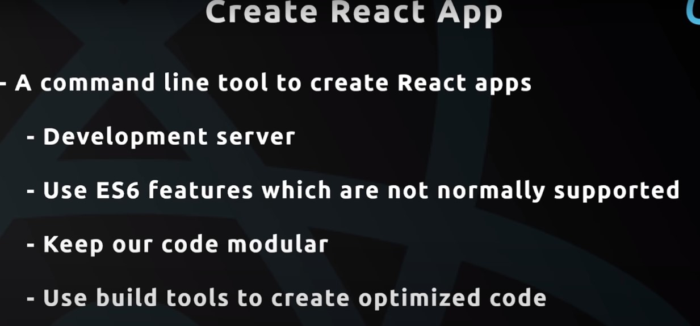

## Creating An App

- Go thru below link

  [Creating an App](https://github.com/facebook/create-react-app)

or run below command

```terminal
npx create-react-app my-app
cd my-app
npm start
```

---

# Single Page Apps and File Structure

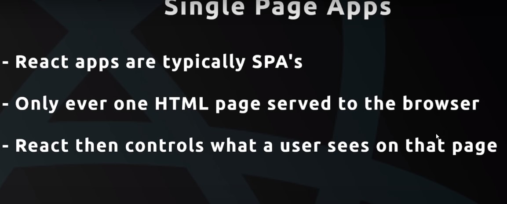

## What is Multi Page App

- To load to different page, v sent different request and gets the response. for
  example, to get index page v sent a request, for contact page v sent another request.

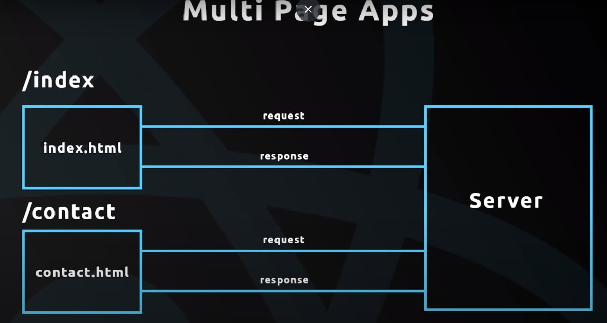

## What is Single Page App

- In SPA, user sent a request to get index page, and gets response index.html.
  once v get index page, if user clicks on a link to contact page, REACT intercepts that request from going to the server and loads the _contact component_ in the browser.

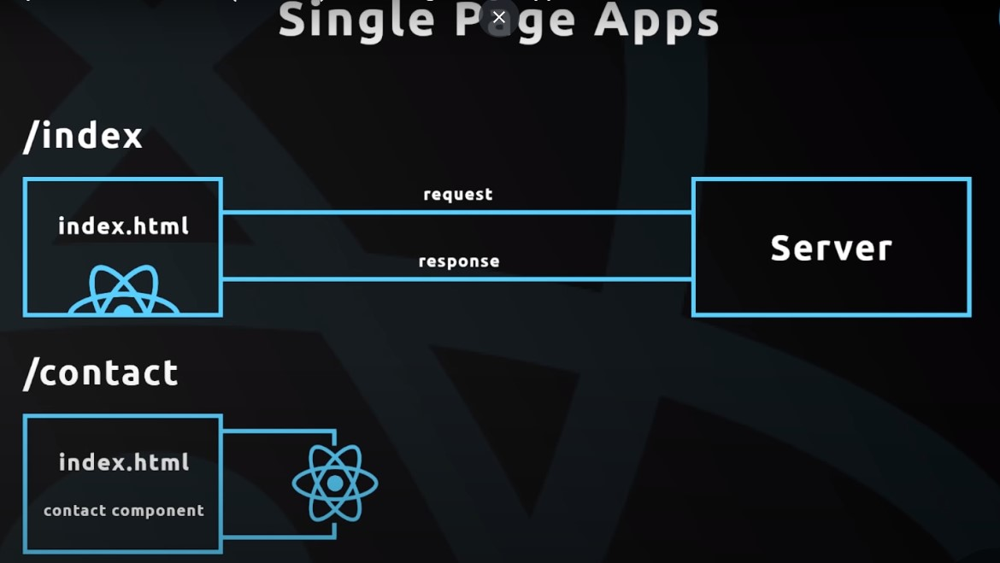

- This way React shows diff. components to the user based on their actions.

## File Structure

**public > index.html** - Initial index file served by the server. React injects the components dynamically to the div element.

```html
<body>
  <noscript>You need to enable JavaScript to run this app.</noscript>
  <div id="root"></div>
  <!--
      This HTML file is a template.
      If you open it directly in the browser, you will see an empty page.

      You can add webfonts, meta tags, or analytics to this file.
      The build step will place the bundled scripts into the <body> tag.

      To begin the development, run `npm start` or `yarn start`.
      To create a production bundle, use `npm run build` or `yarn build`.
    -->
</body>
```

**src > App.js** - is the App component file. v export our App component here

```js
import logo from './logo.svg';
import './App.css';

function App() {
  return (
    <div className='App'>
      <header className='App-header'>
        
        <p>
          Edit <code>src/App.js</code> and save to reload.
        </p>
        <a
          className='App-link'
          href='https://reactjs.org'
          target='_blank'
          rel='noopener noreferrer'
        >
          Learn React
        </a>
      </header>
    </div>
  );
}

export default App;
```

**src > index.js** - where v render our App component to the DOM. V import the App component here

```js
import React from 'react';
import ReactDOM from 'react-dom';
import './index.css';
import App from './App';
import reportWebVitals from './reportWebVitals';

ReactDOM.render(
  <React.StrictMode>
    <App />
  </React.StrictMode>,
  document.getElementById('root')
);

// If you want to start measuring performance in your app, pass a function
// to log results (for example: reportWebVitals(console.log))
// or send to an analytics endpoint. Learn more: https://bit.ly/CRA-vitals
reportWebVitals();
```

---

## Initial Set Up

**App.js**

```js
import './App.css';

function App() {
  return (
    <div className='App'>
      <h2>Welcome to My App</h2>
    </div>
  );
}

export default App;
```

---

# Nesting Components

- Here Root component is App.js, and it rendered to the browser.

- If want to show some other components, we nest them in this root component.

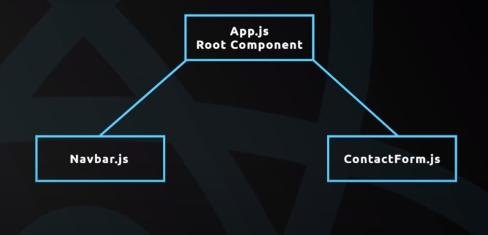

## Create a component nest it in root component

1. _Create component and export_

   **Ninjas.js**

   ```js
   import React, { Component } from 'react';

   class Ninjas extends Component {
     render() {
       return (
         <div className='ninja'>
           <div>Name: Ryu</div>
           <div>Age: 33</div>
           <div>Belt: Black</div>
         </div>
       );
     }
   }
   export default Ninjas;
   ```

2. _Import component and Nest_

   **App.js**

   ```js
   import Ninjas from './Ninjas';

   function App() {
     return (
       <div className='App'>
         <h2>Welcome to My App</h2>
         <Ninjas />
       </div>
     );
   }

   export default App;
   ```

## Why Nesting Components

1. To keep our code modular. one component have it's own state and methods. and v dont have to mix up those with state and methods of other component.

2. Also v can reuse that component and nest it in other components as well.

3. Also it will nice to make contents inside the component more dynamic rather hardcoding the contents to it.

---

# Props

- Props known as property names.

- A feature used to pass data from parent to child component.

  1. first v pass property names and values to nested component in parent component.

     **App.js**

     ```js
     function App() {
       return (
         <div className='App'>
           <h2>Welcome to My App</h2>
           <Ninjas name='kroos' age='29' belt='Black' />
         </div>
       );
     }
     ```

  2. Later v access those property names in child component using _this.props_, and output them in template.

     **Ninja.js**

     ```js
     class Ninjas extends Component {
       render() {
         const { name, age, belt } = this.props;
         return (
           <div className='ninja'>
             <div>Name: {name}</div>
             <div>Age: {age}</div>
             <div>Belt: {belt}</div>
           </div>
         );
       }
     }
     ```

- This how we pass props b/w components and rendering them in the template.

---

# Outputting Array of Objects

_Passing an array of object to the nested component as a Prop. Then receive that array in child component as a Prop.
later loop thru it and output them in template._

1. First create an array of object. Pass that array as prop in nested component.

   **App.js**

   ```js
   function App() {
     state = {
       ninjas: [
         { name: 'kross', age: 34, belt: 'black', id: 1 },
         { name: 'modric', age: 35, belt: 'white', id: 2 },
         { name: 'benzema', age: 33, belt: 'orange', id: 3 },
       ],
     };
     return (
       <div className='App'>
         <h2>Welcome to My App</h2>
         <Ninjas ninjas={this.state.ninjas} />
       </div>
     );
   }
   ```

2. We can have access to the _ninjas_ array in child component using _this.props_.

   **Ninjas.js**

   ```js
   class Ninjas extends Component{
    render(){
   const { ninjas } = this.props;
   return();
   }
   ```

3. Later output each ninjas details in the template. for that v use map method.

   ```js
   class Ninjas extends Component {
     render() {
       const { ninjas } = this.props;
       const ninjaList = ninjas.map((ninja) => {
         return (
           <div className='ninja'>
             <div>Name: {ninja.name}</div>
             <div>Age: {ninja.age}</div>
             <div>Belt: {ninja.belt}</div>
           </div>
         );
       });
     }
   }
   ```

4. v return jsx. and stored that jsx of each ninjas in _ninjasList_. next v o/p this array in _return()_.

   ```js
   class Ninjas extends Component {
     render() {
       const { ninjas } = this.props;
       const ninjaList = ninjas.map((ninja) => {
         return (
           <div className='ninja'>
             <div>Name: {ninja.name}</div>
             <div>Age: {ninja.age}</div>
             <div>Belt: {ninja.belt}</div>
           </div>
         );
       });
       return <div className='ninja-list'>{ninjaList}</div>;
     }
   }
   ```

5. Now it shows a warning in the console.

   ```console
   Warning: Each child in a list should have a unique "key" prop
   ```

   **Solution: Give a unique key for each ninja.**

   ```js
   return (
     <div className='ninja' key={ninja.id}>
       <div>Name: {ninja.name}</div>
       <div>Age: {ninja.age}</div>
       <div>Belt: {ninja.belt}</div>
     </div>
   );
   ```

**Full Process:**
Frist v create an ninjas array and pass it to nested component. v access that array in child compoennt using _this.props_.
thus we get the original array _ninjas_, then map thru that array and got individual ninja. then v return jsx to o/p each individual ninja. and later that jsx is stored to new array called _ninjaList_. and finally v o/p that _ninjasList_ in _return_ method in form of jsx.

---

# Stateless Components

## Two Types of Components

### Container Component

- contains state
- contain lifecycle hooks
- not concerned with UI.
- use classes to create the component.

### UI Component

- they dont contain state
- receive data from props.
- only concerned with UI.
- Use functions to create component.

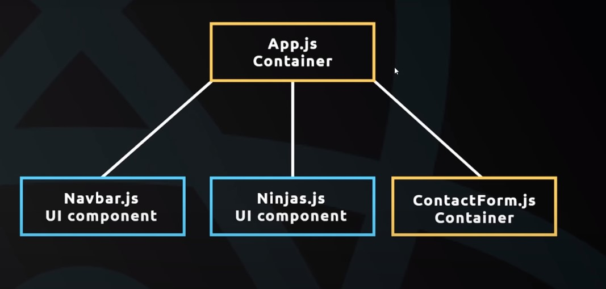

- A container component can have other container component.
- UI components are nested into container component.

## Container component(Class based) to UI component(functional)

**Ninjas.js**

```js
class Ninjas extends Component {
  render() {
    const { ninjas } = this.props;
    const ninjaList = ninjas.map((ninja) => {
      return (
        <div className='ninja'>
          <div>Name: {ninja.name}</div>
          <div>Age: {ninja.age}</div>
          <div>Belt: {ninja.belt}</div>
        </div>
      );
    });
    return <div className='ninja-list'>{ninjaList}</div>;
  }
}
```

- Convert this to UI component or functional component. Since this component receive data from _this.props_. also no _state_ used here.

  **Ninjas.js**

  ```js
  const Ninjas = () => {
    const ninjas = this.props;
    const ninjaList = ninjas.map((ninja) => {
      return (
        <div className='ninja' key={ninja.id}>
          <div>Name: {ninja.name}</div>
          <div>Age: {ninja.age}</div>
          <div>Belt: {ninja.belt}</div>
        </div>
      );
    });
    return <div className='ninja-list'>{ninjaList}</div>;
  };
  ```

- This throws an error in console,

```console
TypeError: Cannot read property 'props' of undefined

```

**Solutions**

**Using props in class based vs functional component**

In functional/UI component, v have to directly pass _props_ to functions as a parameter. Change _this.props_ to _props_, since v r not referring to an instance of a class, instead v set reference to paramter _props_.

Check Below,

```js
const Ninjas = (props) => {
    const {ninjas} = props
```

In Class based component, _props_ r automatically attached to the instance of class. and v reference them by _this.props_.

After converting to functional/UI component

**Ninjas.js**

```js
const Ninjas = ({ ninjas }) => {
  // v destructure the props direclty with in function parentheses.
  const ninjaList = ninjas.map((ninja) => {
    return (
      <div className='ninja' key={ninja.id}>
        <div>Name: {ninja.name}</div>
        <div>Age: {ninja.age}</div>
        <div>Belt: {ninja.belt}</div>
      </div>
    );
  });
  return <div className='ninja-list'>{ninjaList}</div>;
};
```

---

# Conditional Output

## using IF Statement

**Problem**: Only list ninjas with age above 20.

**Ninjas.js**

```js
const ninjaList = ninjas.map((ninja) => {
  if (ninja.age > 20) {
    return (
      <div className='ninja' key={ninja.id}>
        <div>Name: {ninja.name}</div>
        <div>Age: {ninja.age}</div>
        <div>Belt: {ninja.belt}</div>
      </div>
    );
  } else {
    return null;
  }
});
```

## Using ternary operator

**Ninjas.js**

```js
const Ninjas = ({ ninjas }) => {
  const ninjaList = ninjas.map((ninja) => {
    return ninja.age > 20 ? (
      <div className='ninja' key={ninja.id}>
        <div>Name: {ninja.name}</div>
        <div>Age: {ninja.age}</div>
        <div>Belt: {ninja.belt}</div>
      </div>
    ) : null;
  });
  return <div className='ninja-list'>{ninjaList}</div>;
};
```

---

# Forms

Create a form to add ninja - 3 input fields - name, age and belt. on submit, data is added to ninjas array in App.js. When state gets updated, props also gets updated. thus it will rerender the template that outputs the data.

1. First step is to create a class component for this form. since v create states.

2. When ever v update any of the field, handleChange() function fires and keeps the property of state in sync with the input field.

3. we use _target.id_ to find which input field is changed. and then set the value to it.

**AddNinja.js**

```js
export default class AddNinja extends Component {
  state = {
    name: null,
    age: null,
    belt: null,
  };
  handleChange = (e) => {
    this.setState({ [e.target.id]: e.target.value });
  };
  formSubmit = (e) => {
    e.preventDefault();
    console.log(this.state);
  };
  render() {
    return (
      <div>
        <form onSubmit={this.formSubmit}>
          <label htmlFor='Name'>Name: </label>
          <input
            type='text'
            name='name'
            id='name'
            onChange={this.handleChange}
          />
          <label htmlFor='age'>Age: </label>
          <input type='text' name='age' id='age' onChange={this.handleChange} />
          <label htmlFor='belt'>Belt: </label>
          <input
            type='text'
            name='belt'
            id='belt'
            onChange={this.handleChange}
          />
          <button>Submit</button>
        </form>
      </div>
    );
  }
}
```

4. Next we have to import _AddNinja_ component to _App_ component. and nest them in _return_ method of _render_.

   **App.js**

   ```js
     render(){
       return (
       <div className="App">
         <h2>Welcome to My App</h2>
         <Ninjas ninjas={this.state.ninjas}/>
         <AddNinja />
       </div>
     );
     }

   ```

5. After submit v get the state in the console.

   ```console
   {name: "marcelo", age: "33", belt: "Black"}

   ```

Now we get all inputs user given in the fields. storing that in component state. updating those everytime. and then on submit, it takes that state and logging in the console.

---

# Functions as Props

- Need to add state object to state array of App component. So when v add, it updates in the browser.
- We cant access the app component state in Add Ninja Component.

**Steps:**

1. First is to create a function in App component that adds new ninja to the state. Pass that function as _prop_ in AddNinja component that is nested.

   **App.js**

   ```js
   addNinja = (ninja) => {
     console.log(ninja);
   };
   render(){
    return (
    <div className="App">
      <h2>Welcome to My App</h2>
      <Ninjas ninjas={this.state.ninjas}/>
      <AddNinja addNinja={this.addNinja}/>
    </div>
   );
   }
   ```

2. Next call that from AddNinja component. pass current component state as argument.

   **AddNinja.js**

   ```js
   formSubmit = (e) => {
     e.preventDefault();
     this.props.addNinja(this.state);
   };
   ```

   So here v pass new ninja from AddNinja component and log it in App component.

3. Next is to add the new ninja to the state in App component. also add id to new ninja. For that, make a copy of the ninjas array using spread operator and pass new ninja object to it. later set that modified array to the state.

   **App.js**

   ```js
   addNinja = (ninja) => {
     ninja.id = Math.random();
     let ninjas = [...this.state.ninjas, ninja];
     this.setState({
       ninjas: ninjas,
     });
   };
   ```

This how we can pass a function as prop into another component.

---

# Deleting Data

Delete ninjas.

**Steps**

1. Create a function to delete ninja in App Component. pass id as parameter.

2. Pass that function as a _prop_ in nested component _Ninjas_.

   ```js
   deleteNinja = (id) => {
     console.log(id);
   };
   <Ninjas deleteNinja={this.deleteNinja} ninjas={this.state.ninjas} />;
   ```

3. Access that _prop_ passed in _Ninjas_ component. Now we can call this prop in _Ninjas_ component.

4. To call it, v add a button and add an onClick event. assign that prop to it. pass _ninja id_ as argument.

   **Ninja.js**

   ```js
   const Ninjas = ({ninjas, deleteNinja}) => {
     const ninjaList = ninjas.map(ninja => {
         return ninja.age > 20 ?
         (<div className="ninja" key={ninja.id}>
             <div>Name: {ninja.name}</div>
             <div>Age: {ninja.age}</div>
             <div>Belt: {ninja.belt}</div>
             <button onClick={deleteNinja(ninja.id)}>Delete</button>
         </div>): null;
         }
     );
   ```

- So on clicking on button, prop will be fired and corresponding **ninja wont be deleted**. since _deleteNinja()_ automatically getting invoked.

- Solution is to change it to _arrow function_. Thus it won't be invoked automtically on button click.

  ```javascript
  <button
    onClick={() => {
      deleteNinja(ninja.id);
    }}
  >
    Delete
  </button>
  ```

5. Next remove the deleted ninja from ninjas array. Use _filter_ method and filter out the deleted ninja from ninjas array and update the state using _setState_.

   **App.js**

   ```js
   deleteNinja = (id) => {
     let ninjas = this.state.ninjas.filter((ninja) => {
       return ninja.id !== id;
       // if ninja.id and id are equal, returns false then that ninja is filtered out, else returns true, that ninja remains.
     });
     this.setState({
       ninjas: ninjas,
     });
   };
   ```

---

# Recap and Virtual Dom


_App.js_ is the container component. Here v define a state with ninjas property which is an array of ninjas. that array is passed as a prop to _Ninjas.js_ component, which is a UI component. Job of this component is to cycle thru ninjas and o/p them in DOM. We add ninjas from _Addninja.js_ component. We enter data into form and fire addNinja function that passed as prop to _AddNinja.js_ component from _App.js_ component. When v invoke _addNinja_ function, it takes new ninja added & pass it back to ninjas array on the state in _App.js_ component. When state changes, ninjas prop updates which is passed to _Ninjas.js_ component. So when the prop updates, it re-render the template.

Incase of deleting ninjas v follow same strategy, _deleteNinja_ passed as a prop from _App.js_ component to _Ninjas.js_ component. then v invoke the function and pass the id of ninja to App.js component. Inside App.js, inside deleteNinja function v filter thru ninjas array of state and remove the matching ninja. there by updating the state, prop updates and finally template got updated.

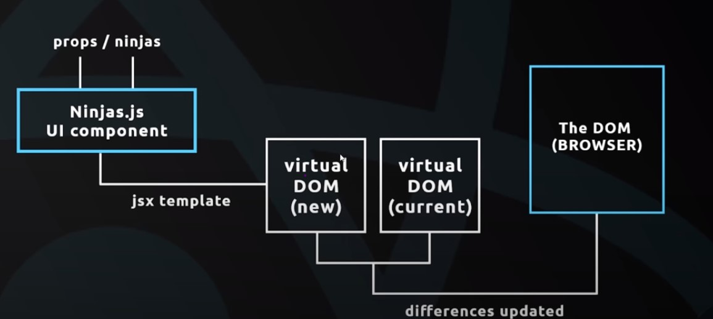

When v update the components, v get new virtual DOM and changes are compared with current virtual DOM and finally differences r updated in the DOM. So whenever v make changes, a new version of virtual DOM is created and is compared with current version of virtual DOM. and only differences in both are rendered in DOM.

---
